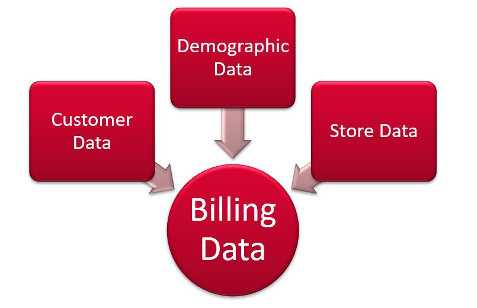
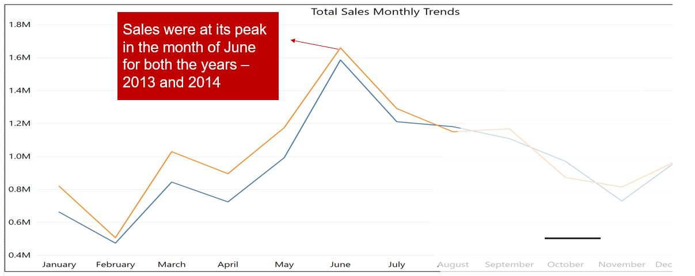
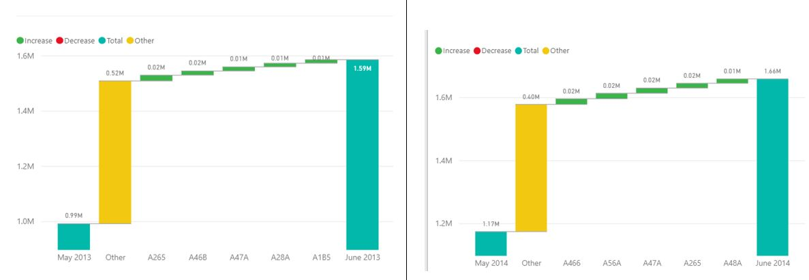

# Data Science challenge Winner

> Predicted "Will Call" sales for different stores based on historical sales data as well as demographic and Store characteristics

## Table of contents
* [General info](#general-info)
* [Screenshots](#screenshots)
* [Technologies and Tools](#technologies-and-tools)
* [Code Examples](#code-examples)
* [Status](#status)
* [Contact](#contact)

## General info

It is a supervise learning problem in which we predicted continuous variable sales. The steps involved are merging of the data, feature preprocessing and engineering, model building and evaluation of the model with the right metric and finally prediction of sales

## Screenshots




## Technologies and Tools
* Python 
* R
* Alteryx
* Tableau

## Code Examples

```
## Data Transformations

train_rec <- recipe(Sales ~ ., data = train) %>%
  step_log(Sales,Foottraffic,Total_Population,Total_HH)%>%
  prep(data = train,retain = TRUE)

train_rec_std <- recipe(Sales ~ ., data = train) %>%
  step_log(Sales,Foottraffic,Total_Population,Total_HH)%>%
  step_center(all_numeric(), -all_outcomes()) %>%
  step_scale(all_numeric(), -all_outcomes())%>%
  prep(data = train,retain = TRUE)

train_tbl <-bake(train_rec, newdata = train)
train_tbl_std <-bake(train_rec_std, newdata = train)

train_panel<-pdata.frame(train_tbl,index = c("Plant","FISCAL_YEAR_PERIOD"))
train_panel_std<-pdata.frame(train_tbl_std,index = c("Plant","FISCAL_YEAR_PERIOD"))

```
