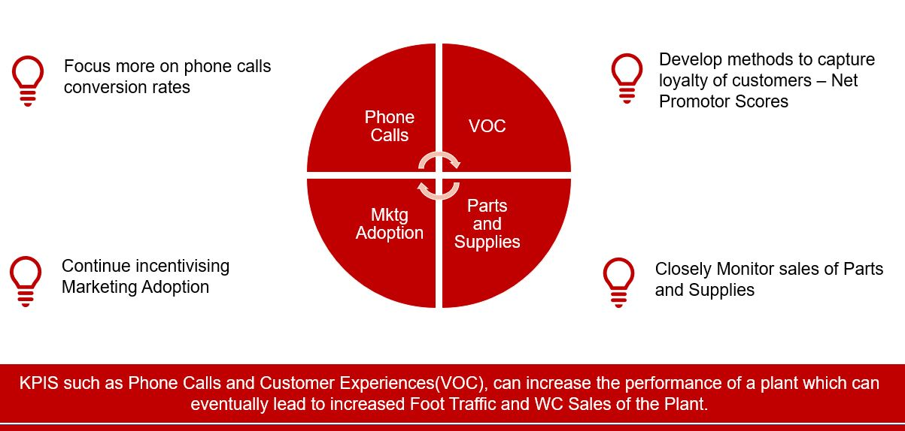
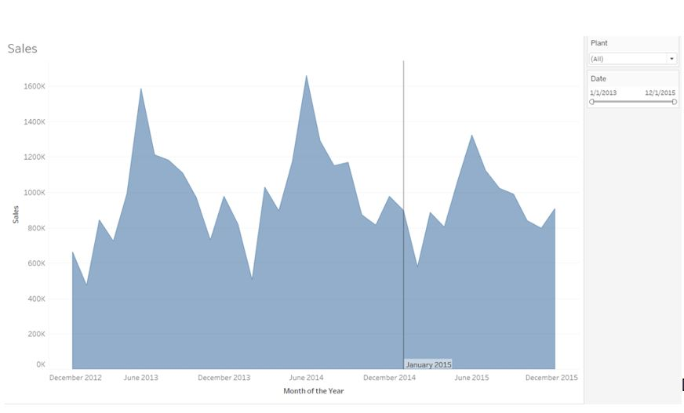

# Data Science challenge Winner

> Predicted "Will Call" sales for different stores based on historical sales data as well as demographic and Store characteristics

## Table of contents
* [General info](#general-info)
* [Screenshots](#screenshots)
* [Technologies and Tools](#technologies-and-tools)
* [Code Examples](#code-examples)
* [Status](#status)
* [Contact](#contact)

## General info

It is a supervise learning problem in which we predicted continuous variable sales. The steps involved are merging of the data, feature preprocessing and engineering, model building and evaluation of the model with the right metric and finally prediction of sales

## Screenshots
### Types of Data


### Sales Trend for Given years


### sales for given years


### Recommended KPIs


### Predicted Sales


## Technologies and Tools
* Python 
* R
* Alteryx
* Tableau

## Code Examples

```
## Data Transformations

train_rec <- recipe(Sales ~ ., data = train) %>%
  step_log(Sales,Foottraffic,Total_Population,Total_HH)%>%
  prep(data = train,retain = TRUE)

train_rec_std <- recipe(Sales ~ ., data = train) %>%
  step_log(Sales,Foottraffic,Total_Population,Total_HH)%>%
  step_center(all_numeric(), -all_outcomes()) %>%
  step_scale(all_numeric(), -all_outcomes())%>%
  prep(data = train,retain = TRUE)

train_tbl <-bake(train_rec, newdata = train)
train_tbl_std <-bake(train_rec_std, newdata = train)

train_panel<-pdata.frame(train_tbl,index = c("Plant","FISCAL_YEAR_PERIOD"))
train_panel_std<-pdata.frame(train_tbl_std,index = c("Plant","FISCAL_YEAR_PERIOD"))
```
```
## Exponential Time Smoothing
x <- c("plant", "date", "KPI","value")
colnames(data)<-x
for (kpi in names(storemet)[3:9]){
  for ( plant in unique(storemet$ï..ï..Plant)){
    tsdata<-ts(storemet[storemet$ï..ï..Plant==plant,kpi],start=c(2013,1),end=c(2014,12),frequency=12)
    HWmodel<-ets(tsdata,model = "ZZA")
    seas_fcast <- forecast(HWmodel, h=12)
    data<-rbind(data,data.frame(rep(plant,12),as.yearmon(time(seas_fcast$mean)), rep(kpi,12),as.numeric(seas_fcast$mean)))
    print(plant)
    }
}
```

```
## Model Training
form=Sales~Store_Size+Foottraffic+I(Foottraffic^2)+PhoneCalls+MktgAdopt+WCMTDtoQuota+I(WCMTDtoQuota^2)+VOC+PartsSuppliesMTDtoQuota+WCMTDtoQuota*Store_Size

#OLS model
plmpooled <- plm(form, data=train_panel, model = "pooling")
summary(plmpooled)

#Fixed Effect Model
plmwithin <- plm(form, data=train_panel, model = "within")
summary(plmwithin)

#Random Effect Model
plmrandom <- plm(form, data = train_panel, model = "random")
summary(plmrandom)
```


## Status
Project is: _finished_. We won this data science challenge among 124 teams.

## Contact
If you loved what you read here and feel like we can collaborate to produce some exciting stuff, or if you
just want to shoot a question, please feel free to connect with me on 
<a href="mailto:jainik.patel1392@gmail.com">email</a> or 
<a href="https://www.linkedin.com/in/jainik-patel/" target="_blank">LinkedIn</a>

